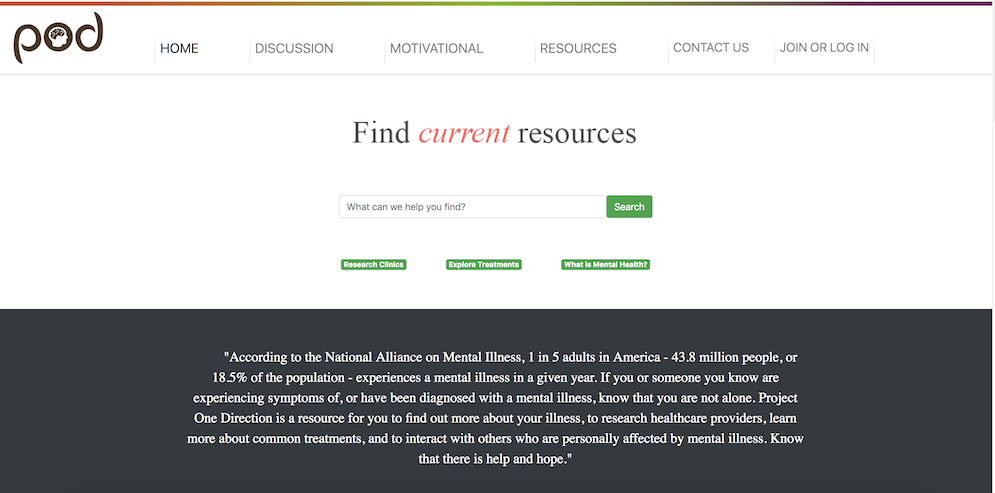

# Project One Direction (Pod)

Project One Direction was created as a resource for those experiencing possible symptoms of mental health disorders, those who have been formally diagnosed with a mental illness, families seeking information to support a loved one, and the public in general.  As a highly prevalent public health issue, POD aims to increase the rate of successful diagnosis and treatment, and to decrease the stigma, or discrimination, rather, that those with mental health disorders and their families face.

## [Deployed Link](https://p1d.herokuapp.com/index.html)



## Getting Started

These instructions will get you a copy of the project up and running on your local machine for development and testing purposes. It will also give an overview of some of the app's functionality. 

### Installing

Git clone the repository to your local machine: 

HTTPS:
```
$ https://github.com/jckmrrssy/C9oneDirection.git
```
SSH:
````
$ git@github.com:jckmrrssy/C9oneDirection.git
````
There is no back-end to this project, so you just need to open index.html in the browser of your choice to get the application running. 

### [Demo](link to demo)

## Built With

* [Bootstrap](https://www.mongodb.com/) - CSS Framework
* [jQuery/Ajax](https://jquery.com/) - Front-end framework & API calls

## Authors

See the list of [contributors](https://github.com/jckmrrssy/C9oneDirection/graphs/contributors) who participated in this project along with individual commit history. 

## Planned updates

In the future, we would like to build this into a platform with some more features outside of information consolidation - such as a discussion board and the ability to chat with someone when you're in need of help. 

